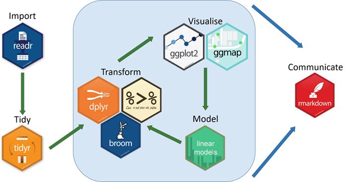
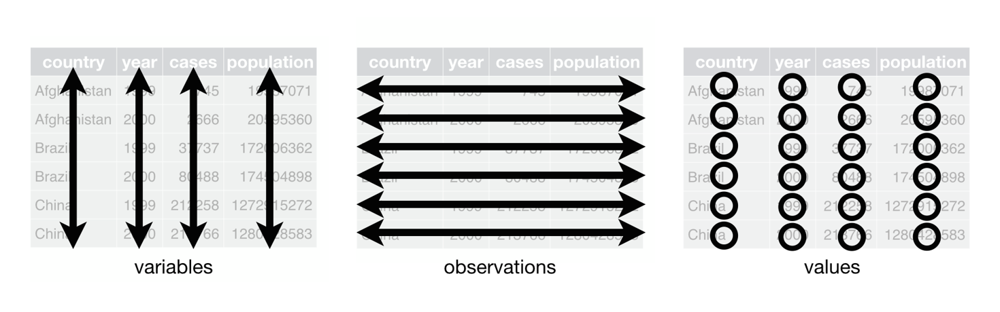
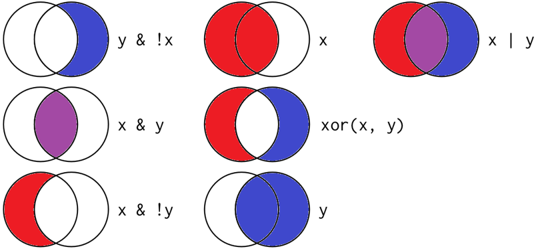
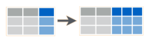

The Life Changing Magic of Tidying Up: 'tidyverse' basics   
========================================================
author: Carey Lab Meeting
date: March 27, 2018
css: Tidyverse_present2.css

What is 'tidyverse'?
========================================================

- Collection of R packages designed for data science
- Packages share an underlying:
  + Design philosophy
  + Grammar
  + Data structure  


What is 'tidyverse'?
========================================================
left: 50%
__Core Packages:__ auto-load with library(tidyverse)
<small>
- ggplot2: graphics
- dplyr: data manipulation
- tidyr: tidy data
- readr: read & parse data files
- purrr: functions & vectors
- tibble: data frames reimagined </small>

***


Why use tidyverse?
========================================================
- Unified grammar and structure
- Tidy code easier to write, read, maintain than base R counterparts (+ is almost always faster to run!)
- Transparent & reproducible workflows  


Style principles
========================================================
_"Good coding style is like correct punctuation: you can manage without it, butitsuremakesthingseasiertoread."_ 

__Three essentials to start:__  

1. Use informative file names
 + variable names = nouns; function names = verbs
2. Load all packages at the beginning of a script  
3. Limit your code to 80 characters per line

Lots more that's worth a read at: [tidyverse style guide] (http://style.tidyverse.org)

Tidy data principles
========================================================
1. Each variable in its own column
2. Each observation in its own row
3. Each value in its own cell  



Reading data
========================================================
- read_csv() reads in .csv files as a tibble

__Tibble benefits:__
- ~10x faster than read.csv()
- Assumes 1st row is column headings by default (no more header = TRUE)  
- Doesn't change input type: parses datetime, characters, etc.
  + No more stringsAsFactors = FALSE
- Doesn't alter variable names (e.g., "column name" does not become "column.name")
- Doesn't assign row.names()

Reading data
========================================================

```r
library(tidyverse)
myData <- read_csv("demo_data.csv")
```

```
# A tibble: 6 x 4
  City        DATE         PRCP  TAVG
  <chr>       <date>      <dbl> <int>
1 Los Angeles 2017-01-01 0.        50
2 Miami       2017-01-01 0.        76
3 Fairbanks   2017-01-01 0.        12
4 Minneapolis 2017-01-01 0.        26
5 Roanoke     2017-01-01 0.0300    46
6 Los Angeles 2017-01-02 0.        53
```
Notice that the DATE column automatically parsed as a date  
__No need__ for the as.Date(myData$DATE) command!

Data transformation
========================================================
left: 50%
- __filter()__
- __arrange()__
- __select()__
- __mutate()__
- __summarise()__  

***
 


Pipes: Link commands together
========================================================
left: 70%
- Use %>% when you find yourself  
  + __composing multiple functions in a nested call__, or 
  + __creating intermediate objects that you don't care about saving__

- Put each verb on its own line
  + This makes it simpler to rearrange them later, and makes it harder to overlook a step

%>% should always have *a space before it*    
and *a new line after it*

***


Core commands: filter()
========================================================
- filter() can include multiple arguments with Boolean operations  
  
- Select multiple items from within a string:
  + <small>x %in% c('y', 'z')</small>
- filter() excludes both FALSE and NA values by default

Core commands: filter()
========================================================

```r
SEast <- filter(myData, City == "Roanoke" | City == "Miami")
```

```
# A tibble: 6 x 4
  City    DATE         PRCP  TAVG
  <chr>   <date>      <dbl> <int>
1 Miami   2017-01-01 0.        76
2 Roanoke 2017-01-01 0.0300    46
3 Miami   2017-01-02 0.        80
4 Roanoke 2017-01-02 0.0900    47
5 Miami   2017-01-03 0.690     80
6 Roanoke 2017-01-03 0.510     44
```
OR filter using a list

```r
SEast <- filter(myData, City %in% c("Roanoke", "Miami"))
```

```
# A tibble: 6 x 4
  City    DATE         PRCP  TAVG
  <chr>   <date>      <dbl> <int>
1 Miami   2017-01-01 0.        76
2 Roanoke 2017-01-01 0.0300    46
3 Miami   2017-01-02 0.        80
4 Roanoke 2017-01-02 0.0900    47
5 Miami   2017-01-03 0.690     80
6 Roanoke 2017-01-03 0.510     44
```

Core commands: select()
========================================================
- Select (or anti-select) columns by name

- Or use a helper function within select:
  + starts_with("abc"): matches names that begin with "abc"
  + ends_with("xyz"): matches names that end with "xyz"
  + contains("ijk"): matches names that contain "ijk"
  + matches("(.)\\1"): selects variables that match a regular expression
    This one matches any variables that contain repeated characters 
    
Core commands: select()
========================================================
You can select columns by name without quotes

```r
temps <- select(myData, City, DATE, TAVG)
names(temps)
```

```
[1] "City" "DATE" "TAVG"
```
Or, rather than selecting all but *one* column,  
"anti-select" the one to drop

```r
temps <- select(myData, -PRCP)
names(temps)
```

```
[1] "City" "DATE" "TAVG"
```


Core commands: mutate()
========================================================
- Create a new variable column

- mutate(df, new_column = how_you_create_it)
  + Create using arithmetic operators (+, -, *, /, ^)
  + Transform variables with log(), log10(), etc.
  + And many more possibilities!

- Variations of mutate()
  + transmute() to keep __only__ the new (mutated) columns
  + rename(df, new_name = old_name) 
  
Core commands: mutate()
========================================================
Oops, our data is in Fahrenheit! Need a column with Celsius!

```r
temps <- temps %>% 
  rename(Temp_F = TAVG) %>%
  mutate(Temp_C = ((Temp_F - 32) * (5/9)))
```

```
# A tibble: 6 x 4
  City        DATE       Temp_F Temp_C
  <chr>       <date>      <int>  <dbl>
1 Los Angeles 2017-01-01     50  10.0 
2 Miami       2017-01-01     76  24.4 
3 Fairbanks   2017-01-01     12 -11.1 
4 Minneapolis 2017-01-01     26  -3.33
5 Roanoke     2017-01-01     46   7.78
6 Los Angeles 2017-01-02     53  11.7 
```

Core commands: summarise()
========================================================
- Collapse your dataframe into a single row
- Most useful when paired with group_by() for grouped summaries

- Includes basic summary metrics
  + <small>n(), n_distinct()
  + mean(), median()
  + sd()
  + sum() </small>

- __Important note:__ NA values are *not excluded* by default
  + Include na.rm = TRUE in each clause to exclude NA's

Core commands: summarise()
========================================================
Let's find out the 2017 mean temperature in each city:

```r
annual <- temps %>% 
  mutate(year = lubridate::year(DATE)) %>%
  filter(year == 2017) %>%
  group_by(City, year) %>%
  summarise(Mean = mean(Temp_C, na.rm = T))

annual
```

```
# A tibble: 5 x 3
# Groups:   City [?]
  City         year   Mean
  <chr>       <dbl>  <dbl>
1 Fairbanks   2017.  -1.10
2 Los Angeles 2017.  17.9 
3 Miami       2017.  25.9 
4 Minneapolis 2017.   9.26
5 Roanoke     2017.  15.0 
```


Core commands: spread() & gather()
========================================================
__spread__(long, column_with_names, column_with_values)   


__gather__(wide, new_names, new_values, A:Z, factor_key = T)  
  + A:Z: Names of source columns that contain values
  + factor_key: Treat the new key column as a factor (instead of character vector)  
  
  
Core commands: spread() & gather()
========================================================
Maybe we want to compare Miami and Roanoke temps each day:

```r
dataWide <- myData %>%
  select(-PRCP) %>%
  filter(City %in% c('Roanoke', 'Miami')) %>%
  spread(City, TAVG) 

dataWide
```

```
# A tibble: 430 x 3
   DATE       Miami Roanoke
   <date>     <int>   <int>
 1 2017-01-01    76      46
 2 2017-01-02    80      47
 3 2017-01-03    80      44
 4 2017-01-04    76      51
 5 2017-01-05    74      34
 6 2017-01-06    72      31
 7 2017-01-07    78      24
 8 2017-01-08    59      16
 9 2017-01-09    61      16
10 2017-01-10    70      26
# ... with 420 more rows
```

Core commands: separate() & unite()
========================================================
__separate__(old_column, into = c("A", "B"), sep = "_")
- Default split wherever there is a non-alphanumeric character
  + Can manually set split with sep = " "  


__unite__(new_column, A, B, sep = "")  
- Use sep = "_" or similar to add seperator in new column


Writing data
========================================================
left: 70%
- write_csv() writes a .csv file

__Benefits:__
- ~2x faster than write.csv() for large files
- Saves dates and date-times in ISO-8601 format with UTC timezone
- No need for row.names = FALSE

***


Bonus packages
========================================================
left: 70%
__lubridate__
- Easily work with dates!
  + Parsing of date-times: ymd(), ymd_hms()
  + Functions to get and set components of a date-time: year(), month(), mday()
  - Learn more: [lubridate cheat sheet](https://github.com/rstudio/cheatsheets/raw/master/lubridate.pdf)
  
***


lubridate
========================================================
Extract years and months painlessly from DateTime columns

*Note*: Date parts are parsed to double by default,   
but you can specify factor() within the mutate command

```r
library(lubridate)

temps <- temps %>% 
  mutate(year = year(DATE), month = factor(month(DATE)))
```

```
# A tibble: 6 x 6
  City        DATE       Temp_F Temp_C  year month
  <chr>       <date>      <int>  <dbl> <dbl> <fct>
1 Los Angeles 2017-01-01     50  10.0  2017. 1    
2 Miami       2017-01-01     76  24.4  2017. 1    
3 Fairbanks   2017-01-01     12 -11.1  2017. 1    
4 Minneapolis 2017-01-01     26  -3.33 2017. 1    
5 Roanoke     2017-01-01     46   7.78 2017. 1    
6 Los Angeles 2017-01-02     53  11.7  2017. 1    
```


Bonus packages
========================================================
left: 70%
__broom__
- Convert statistical analysis objects from R into tidy data frames, so that they can more easily be combined, reshaped and otherwise processed with tools like dplyr, tidyr and ggplot2

***


broom: Zip through analyses across groups!
========================================================
For example, we can fit a regression for each city with one command...

```r
temp_correlations <- temps %>% 
  group_by(City) %>%
  do(broom::tidy(lm(.$Temp_C ~ .$DATE)))
```

```
# A tibble: 6 x 6
# Groups:   City [3]
  City        term          estimate std.error statistic   p.value
  <chr>       <chr>            <dbl>     <dbl>     <dbl>     <dbl>
1 Fairbanks   (Intercept)  142.      110.           1.30 0.196    
2 Fairbanks   .$DATE        -0.00839   0.00631     -1.33 0.185    
3 Los Angeles (Intercept)  -78.5      23.2         -3.39 0.000776 
4 Los Angeles .$DATE         0.00553   0.00133      4.14 0.0000416
5 Miami       (Intercept)   56.9      25.9          2.20 0.0287   
6 Miami       .$DATE        -0.00182   0.00149     -1.22 0.224    
```


Additional resources 
========================================================
left: 70%
- [R for Data Science] (http://r4ds.had.co.nz/)
- [RStudio cheat sheets] (https://www.rstudio.com/resources/cheatsheets/)
- [A gRadual intRoduction to the tidyverse] (https://github.com/Cascadia-R/gRadual-intRoduction-tidyverse?utm_content=buffer193d5&utm_medium=social&utm_source=twitter.com&utm_campaign=buffer): Self-guided workshop
- [Switching from Base R to tidyverse] (http://www.significantdigits.org/2017/10/switching-from-base-r-to-tidyverse/): List of equivalent commands

***


# Comments about comments
========================================================
left: 70%
*In code, use comments to explain the "why" not the "what" or "how"* 

- Use comments to record important findings and analysis decisions
- If you need comments to explain what your code is doing, consider rewriting your code to be clearer 
- If you discover that you have more comments than code, considering switching to RMarkdown

From [Tidyverse Style Guide] (http://style.tidyverse.org/)

***

